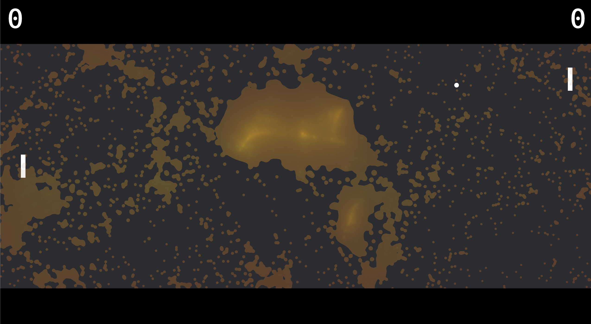

# FluidPong: Milestone
### Trinity Chung, Anna Dymchenko, Oliver Ni, Tiffany Sun

<iframe src="https://docs.google.com/presentation/d/e/2PACX-1vTQ6_dG-hq5RH434CnaCCcsBOOtxrCnGD5rbzvyQ4p38VsX2gwbxiadZ8nqsVhl3DERD4g_tlAViE7q/embed?start=true&loop=true&delayms=3000" frameborder="0" width="960" height="569" allowfullscreen="true" mozallowfullscreen="true" webkitallowfullscreen="true"></iframe>
Link to slides: [https://docs.google.com/presentation/d/1c8SNqwCMYDlIjJLUUo8TMi4K9p8eQGq_Rw8kTFmvSWY/edit?usp=sharing](https://docs.google.com/presentation/d/1c8SNqwCMYDlIjJLUUo8TMi4K9p8eQGq_Rw8kTFmvSWY/edit?usp=sharing)

## Preliminary Progress
We implemented a simplified FluidPong in Rust!

Currently, ball applies force on fluid but not vice versa.
We are currently using Smoothed-Particle Hydrodynamics (SPH) with a metaball shader, with color based on speed and opacity based on density.
For implementing SPH, we referenced [this paper](https://cg.informatik.uni-freiburg.de/intern/seminar/gridFluids_fluid-EulerParticle.pdf).

## Reflections
The challenging part of this project of course is not Pong, but making the Fluid look more interesting.
Now that we are more familiar with writing graphics in Rust, we wish to try implementing a more advanced fluid such as Naiver-Stokes, or potentially simulating 3d and projecting onto 2d.

## Updated Work Plan
- Try Naiver-Stokes fluid simulation in addition to SPH.
- Improve the shader.
- Investigate speed-ups.
- Make pong paddles and ball interact with fluid more intimately.
